# Contract Testing Workflow Diagrams

Supplementary visual guide for CONTRACT-TESTING-STRATEGY.md

---

## Quick Reference: Pact Workflow

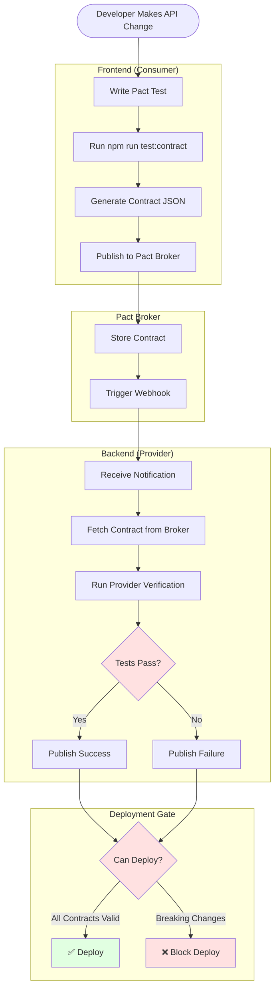

---

## Detailed: Consumer Test Workflow (Frontend)

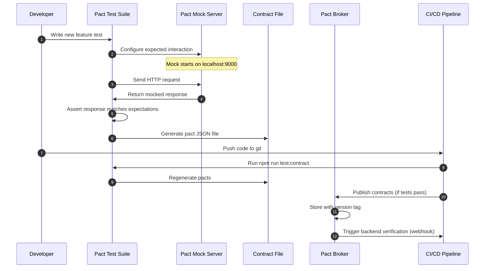

---

## Detailed: Provider Verification Workflow (Backend)

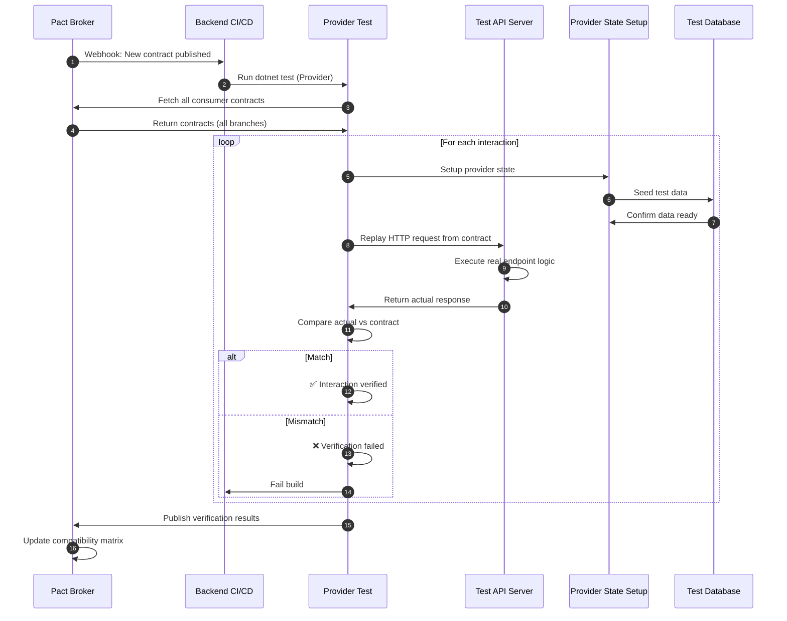

---

## Type Generation Flow

```mermaid
flowchart LR
    subgraph Backend["KbStore Backend"]
        A1[ASP.NET Minimal APIs]
        A2[Endpoint Annotations]
        A3[OpenAPI Generator]
        A4[openapi.json Spec]
    end

    subgraph Artifacts["Artifact Storage"]
        B1[Published openapi.json]
    end

    subgraph Frontend["KbClient Frontend"]
        C1[openapi-typescript CLI]
        C2[Generated api.d.ts]
        C3[Service Layer]
        C4[React Components]
    end

    A1 --> A2
    A2 --> A3
    A3 --> A4
    A4 --> B1
    B1 --> C1
    C1 --> C2
    C2 --> C3
    C3 --> C4

    style A4 fill:#e1f5ff
    style C2 fill:#e1ffe1
```

**Trigger Points**:
- **Manual**: `npm run generate:types` (dev)
- **Automated**: CI/CD on backend deployment
- **Scheduled**: Nightly cron job to catch drift

---

## Breaking Change Handling

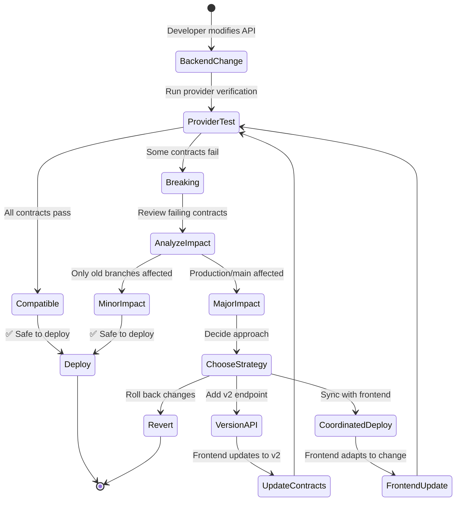

---

## CI/CD Integration Points

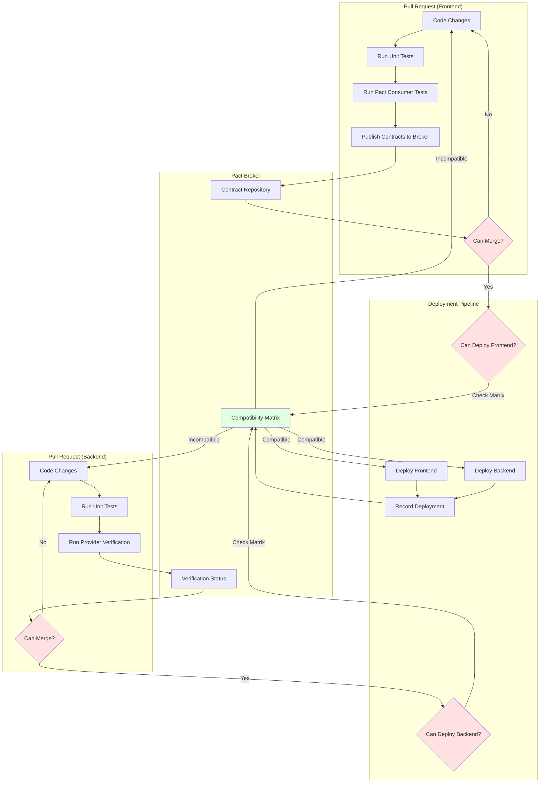

---

## Comparison: With vs Without Pact

### Without Pact (Current State)

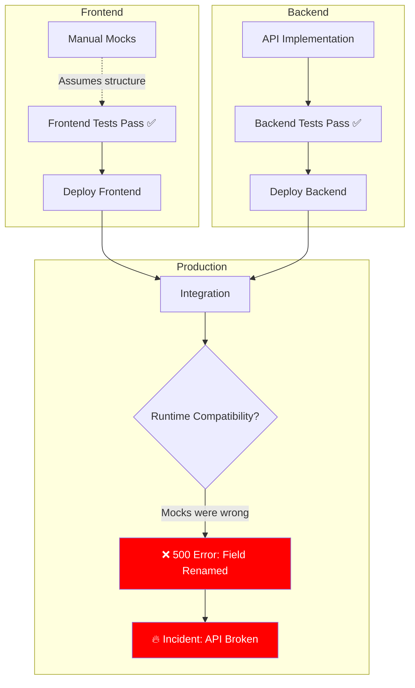

**Problem**: Drift discovered in production.

---

### With Pact (Proposed State)

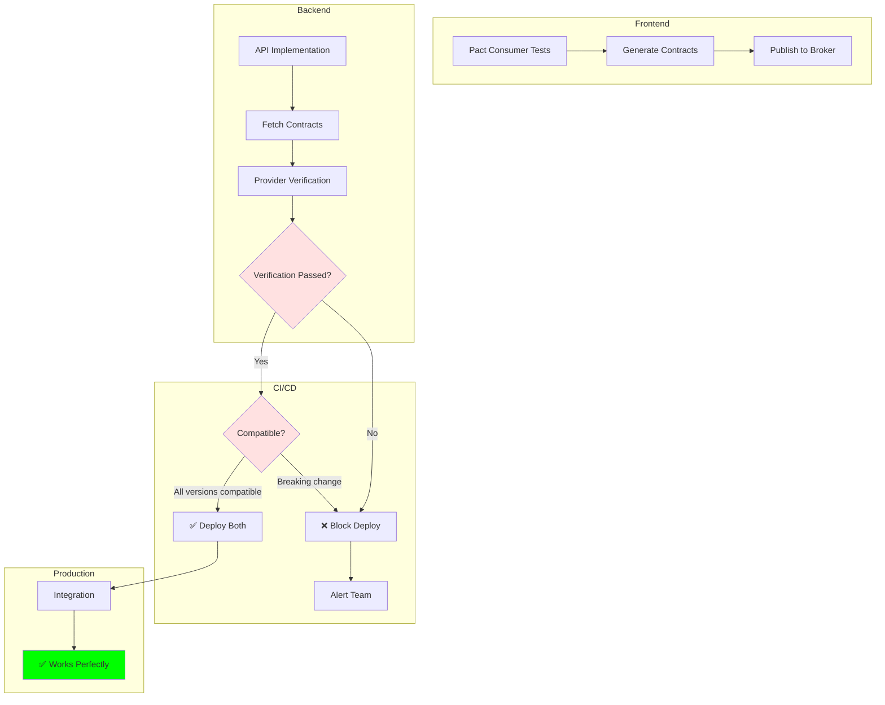

**Result**: Drift caught before deployment.

---

## Developer Experience: Daily Workflow

### Frontend Developer Journey

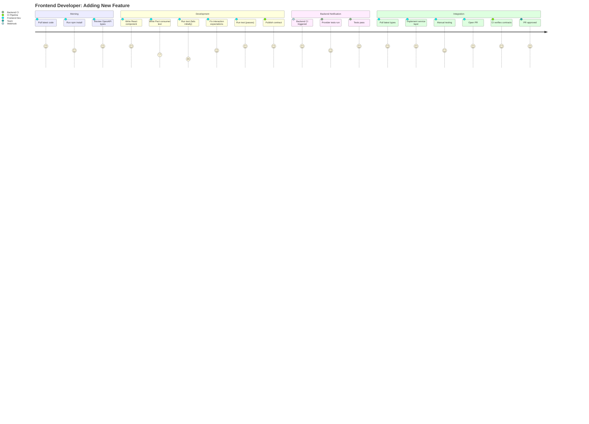

---

### Backend Developer Journey

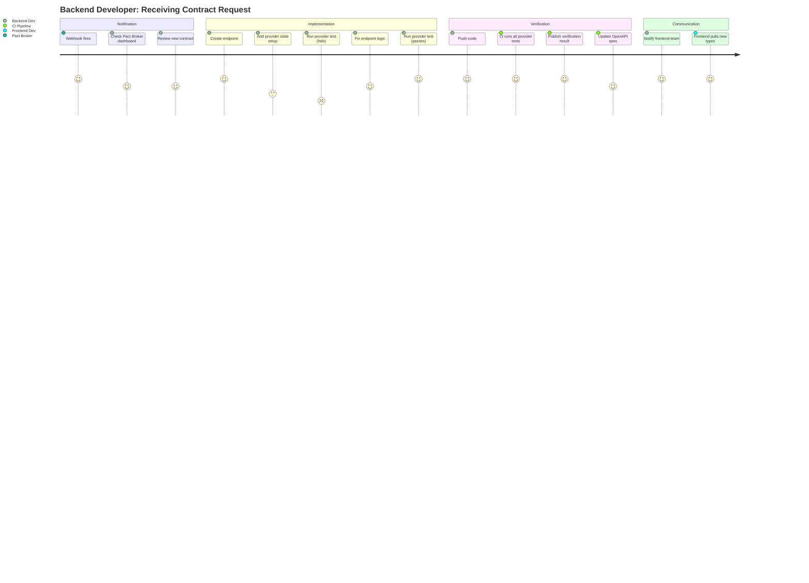

---

## Migration Timeline

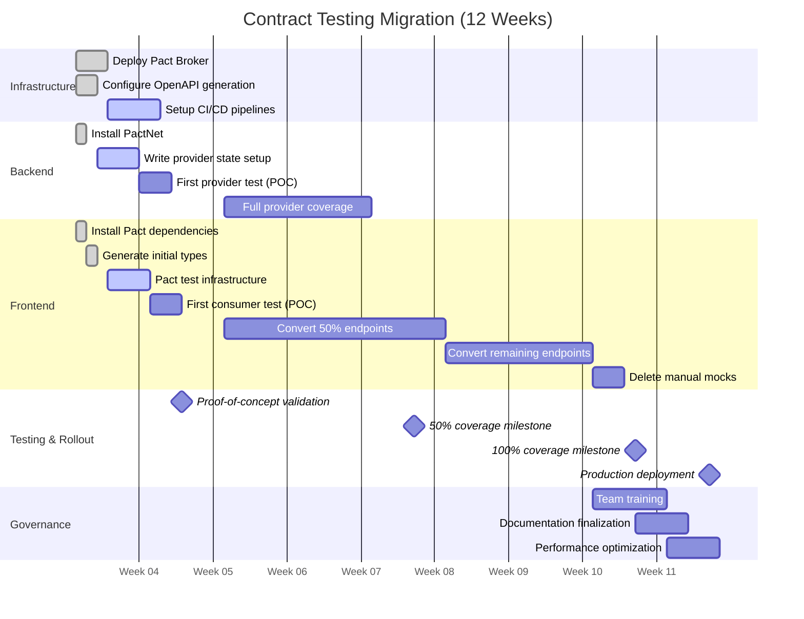

---

## Contract Compatibility Matrix Example

### Visual Representation

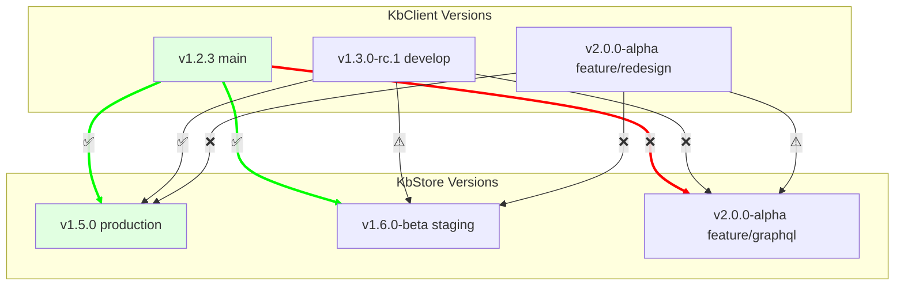

**Legend**:
- ✅ **Compatible**: Safe to deploy together
- ⚠️ **Pending**: Verification in progress
- ❌ **Incompatible**: Breaking changes detected

---

## Error Recovery Flow

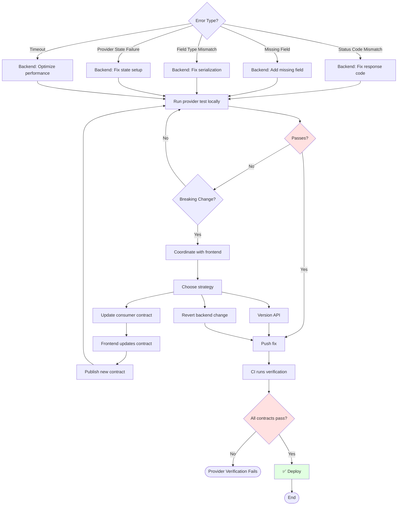

---

## Webhook Configuration Flow

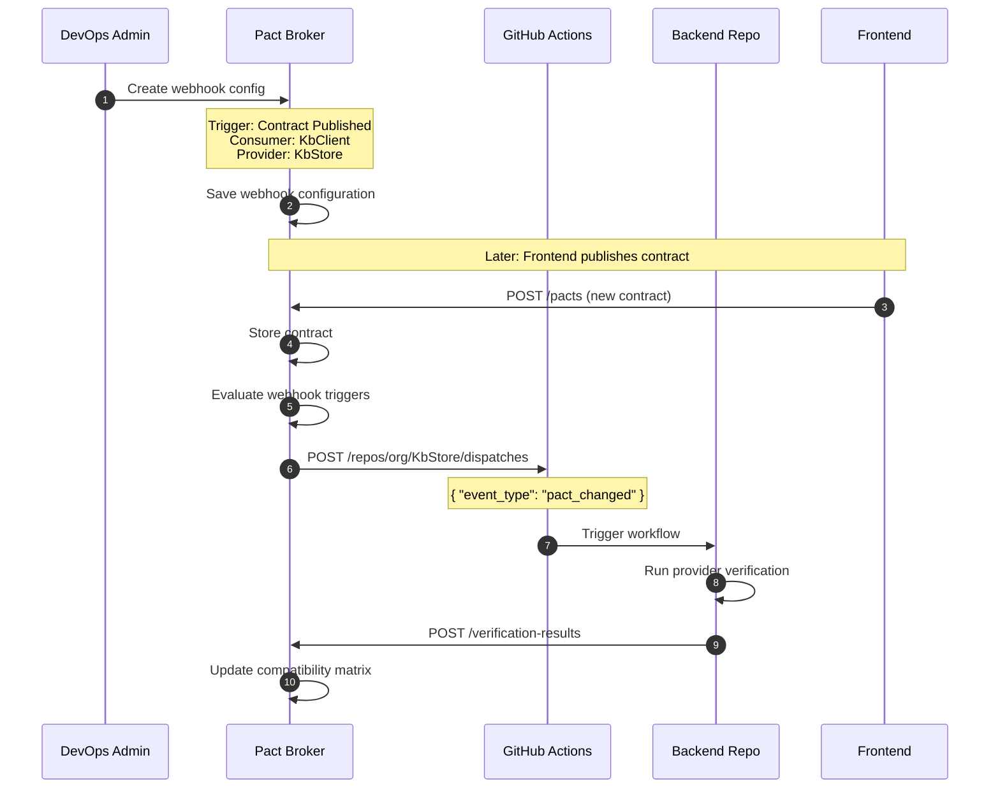

---

## Pact Matchers Example

### Type Matching (Flexible)

```typescript
// Consumer test uses matchers for flexibility
import { Matchers } from '@pact-foundation/pact';

await provider.addInteraction({
  willRespondWith: {
    body: {
      productId: Matchers.uuid(),           // Any valid UUID
      sku: Matchers.like('WIDGET-001'),     // Any string
      name: Matchers.like('Widget'),        // Any string
      quantity: Matchers.integer(100),      // Any integer
      price: Matchers.decimal(9.99),        // Any decimal
      isAvailable: Matchers.boolean(true),  // Any boolean
      createdOn: Matchers.iso8601DateTime(), // Any ISO datetime
    }
  }
});
```

**Backend verification**: Must return response with **correct types**, but **values can differ**.

---

### Exact Matching (Strict)

```typescript
// When exact values matter (e.g., specific error codes)
await provider.addInteraction({
  willRespondWith: {
    status: 400, // Exact status code required
    body: {
      type: 'https://tools.ietf.org/html/rfc7231#section-6.5.1',
      title: 'Bad Request', // Exact string required
      status: 400,
    }
  }
});
```

---

## Cost-Benefit Analysis

### Initial Investment (Weeks 1-4)

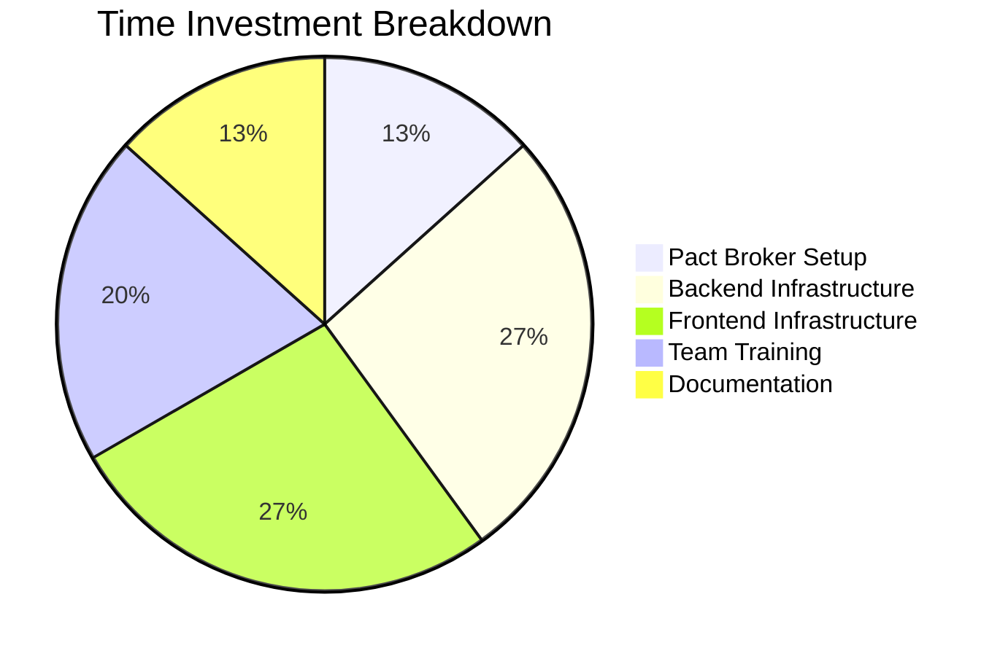

**Total**: ~60 hours (~1.5 weeks for team of 4)

---

### Long-Term Savings (Per Year)

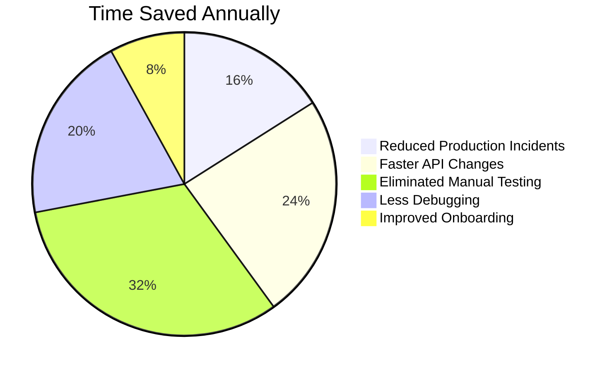

**Total**: ~250 hours saved/year (~6 weeks)

**ROI**: Break-even in ~3 months

---

## Monitoring Dashboard (Pact Broker)

### Example Metrics View

```
┌─────────────────────────────────────────────────────────┐
│ Pact Broker Dashboard                                   │
├─────────────────────────────────────────────────────────┤
│                                                         │
│ ✅ Overall Health: HEALTHY                              │
│                                                         │
│ Consumer: KbClient                                      │
│ Provider: KbStore                                       │
│ Latest Contract: v1.3.0 (2025-01-19 14:32)              │
│ Verification: ✅ PASSED (15 interactions)                │
│                                                         │
│ ┌───────────────────────────────────────────────────┐  │
│ │ Compatibility Matrix                              │  │
│ ├───────────────────────────────────────────────────┤  │
│ │          KbStore v1.5.0  v1.6.0-beta  v2.0.0-alpha│  │
│ │ KbClient                                          │  │
│ │   v1.2.3       ✅            ✅            ❌      │  │
│ │   v1.3.0       ✅            ⚠️            ❌      │  │
│ │   v2.0.0       ❌            ❌            ⚠️      │  │
│ └───────────────────────────────────────────────────┘  │
│                                                         │
│ Recent Verifications:                                   │
│   • 2025-01-19 14:35 - KbStore v1.6.0-beta - ✅ PASSED  │
│   • 2025-01-19 12:21 - KbStore v1.5.0 - ✅ PASSED       │
│   • 2025-01-19 09:15 - KbStore v2.0.0-alpha - ❌ FAILED │
│                                                         │
│ Pending Deployments:                                    │
│   • KbClient v1.3.0 → staging ⚠️ (awaiting KbStore)    │
│   • KbStore v1.6.0-beta → production ✅ (can deploy)    │
│                                                         │
└─────────────────────────────────────────────────────────┘
```

---

## Quick Command Reference

### Frontend Commands

```bash
# Generate TypeScript types from OpenAPI
npm run generate:types

# Run Pact consumer tests
npm run test:contract

# Publish contracts to broker
npm run pact:publish

# Check if version can be deployed
npx pact-broker can-i-deploy \
  --pacticipant=KbClient \
  --version="1.3.0" \
  --to-environment=production

# Record deployment
npx pact-broker record-deployment \
  --pacticipant=KbClient \
  --version="1.3.0" \
  --environment=production
```

---

### Backend Commands

```bash
# Run provider verification tests
dotnet test --filter "KbStoreProviderTests"

# Export OpenAPI spec
curl http://localhost:5000/openapi/v1.json > openapi.json

# Check if version can be deployed
docker run --rm pactfoundation/pact-cli:latest \
  broker can-i-deploy \
  --pacticipant=KbStore \
  --version="1.6.0" \
  --to-environment=production

# Record deployment
docker run --rm pactfoundation/pact-cli:latest \
  broker record-deployment \
  --pacticipant=KbStore \
  --version="1.6.0" \
  --environment=production
```

---

### Pact Broker Administration

```bash
# List all contracts
npx pact-broker list-latest-pact-versions

# View compatibility matrix
npx pact-broker matrix \
  --pacticipant=KbClient \
  --pacticipant=KbStore

# Create webhook
npx pact-broker create-webhook \
  "https://api.github.com/repos/org/KbStore/dispatches" \
  --consumer=KbClient \
  --provider=KbStore \
  --contract-published

# Delete old contracts (cleanup)
npx pact-broker clean \
  --pacticipant=KbClient \
  --keep-versions=10
```

---

## Summary

This workflow guide provides visual references for:

1. **Process Flows**: How Pact integrates into development
2. **Sequence Diagrams**: Step-by-step interactions
3. **State Machines**: Decision trees for error handling
4. **Timelines**: Migration planning
5. **Comparisons**: Before/after Pact adoption
6. **Developer Journeys**: Daily workflows for frontend/backend teams

Use alongside the main CONTRACT-TESTING-STRATEGY.md for implementation.

---

**Document Version**: 1.0
**Last Updated**: 2025-01-19
**See Also**: CONTRACT-TESTING-STRATEGY.md (main document)
